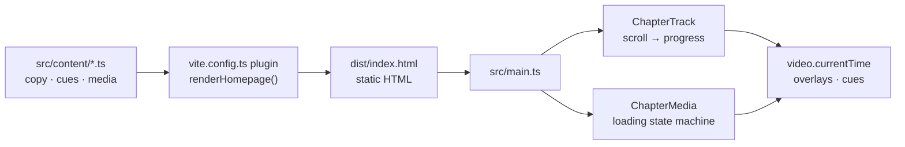

# Gulfalts Homepage (V3)

The Gulfalts homepage: one scroll-driven film, *From Space to Destination*, that starts over the Gulf and ends on a live map of Gulfalts' destinations in Al Quoz, Dubai.

**Live:** [gulfalts-homepage.vercel.app](https://gulfalts-homepage.vercel.app) · **Stack:** Vite 7, TypeScript, GSAP ScrollTrigger, Lenis, Mapbox GL JS · **Hosting:** Vercel (static)

| | |
|---|---|
| **What it is** | A single static page. All copy, stats and links are real HTML rendered at build time, so the page reads without video; video adds motion on top. |
| **Framework** | None at runtime. Vite compiles plain TypeScript and CSS; there is no React or Vue. |
| **Runtime dependencies** | `gsap` (ScrollTrigger), `lenis` (wheel smoothing) and `mapbox-gl` (H13 location map, loaded on demand) |
| **Source** | [`v3/`](v3) |
| **Production** | Vercel project `gulfalts-team/gulfalts-homepage`, Node 22.x |
| **Design rules** | [`GULFALTS-DESIGN.md`](GULFALTS-DESIGN.md), with type and colour following the gulfalts.com style guide ([`tokens.css`](v3/src/styles/tokens.css)) |

## Quickstart

You need Node 20.19 or newer (Vite 7). Production runs Node 22.

```bash
cd v3
npm ci
echo "VITE_MAPBOX_TOKEN=pk.…" > .env   # Mapbox public token, see Location map
npm run dev    # http://127.0.0.1:5175
```

| Command (from `v3/`) | What it does |
|---|---|
| `npm run dev` | Starts the dev server on `127.0.0.1:5175`, reloading on changes |
| `npm run build` | Type-checks, then builds the site into `v3/dist/` |
| `npm run preview` | Serves the production build on `127.0.0.1:4175` |
| `npm run typecheck` | Runs `tsc --noEmit` only |
| `npm run media` | Re-encodes video and images from the source masters (needs ffmpeg; see [Media](#media)) |
| `npm run routes` | Recomputes the location map's routes and drive times with Mapbox Directions (needs the token in `.env`; see [Location map](#location-map)) |

## How it works

### Build time

[`vite.config.ts`](v3/vite.config.ts) registers a small plugin. It replaces `<!-- homepage:sections -->` in [`index.html`](v3/index.html) with the output of `renderHomepage()` from [`src/sections`](v3/src/sections). Copy, cue timings and media paths come from typed files in [`src/content`](v3/src/content). The finished `dist/index.html` contains the whole page as crawlable, screen-reader-friendly HTML.



### Run time

- **Scroll-scrubbed chapters.** Each chapter is a tall `.chapter_track` holding a `position: sticky` stage. `ChapterTrack` ([`scroll-scrub.ts`](v3/src/lib/scroll-scrub.ts)) turns the scroll position into progress from 0 to 1 and maps that onto `video.currentTime`. Native scrolling is never hijacked; Lenis only smooths wheel input.
- **Overlays.** `data-show="a-b"` shows an element while progress is between `a` and `b`. `data-cue="id"` shows it while that cue is active.
- **Joins.** A chapter with `joinPrevious` slides under the one before it. It then either dissolves in (H02, H13) or wipes in from the bottom (H04, `joinStyle: 'wipe'`), driven by the `--join-p` CSS variable.
- **Media loading.** `ChapterMedia` ([`media-loader.ts`](v3/src/lib/media-loader.ts)) moves through `idle → loading → ready → active ⇄ paused`. On failure it goes to `error → fallback`, and the poster stays on screen. The current state is shown in each section's `data-state` attribute.
- **What loads when.** Only H02 loads with the page. Every other video starts buffering one screen before it arrives, or once the previous video chapter is 55% through.
- **Whole-file playback.** Each video is downloaded in full and played from a blob URL, so every frame can be seeked to, even on hosts that ignore HTTP Range requests (for example Webflow Cloud).
- **Mobile (under 768px).** Phones get separate 608×1080 encodes and shorter scroll tracks.
- **Reduced motion.** There is no pinning, scrubbing or video. Every chapter shows its poster with the full copy, and H11 becomes a sequence of stills.
- **Sub-path hosting.** Media URLs are prefixed with Vite's `BASE_URL` at load time, so the same build also works when mounted under a path such as `/new-home/`.
- **Location map (H13).** When the outro reaches its last frame, a live Mapbox map dissolves in over it. See [Location map](#location-map).

### Chapter map

| ID | Chapter | Media | Video size (desktop / mobile) |
|---|---|---|---|
| H01 | Intro: logo reveal | None; it sits on H02's first frame | — |
| H02 | Dubai arrival | Scrub | 5.0 MB / 2.0 MB |
| H04 | The firm (brand manifesto) | Autoplay loop, wipe join | 1.5 MB / 0.6 MB |
| — | Our destinations (slider) | Static | — |
| H05 · H08 | Featured: Dubai Creative Park, Dubai Fintech District | Static | — |
| H11 | Our approach: raw space to living destination | Scrub | 12.2 MB / 3.8 MB |
| H13 | Our destinations: Dubai pull-out, then a live Mapbox map with the directory | Scrub, played in reverse, then Mapbox | 4.9 MB / 1.9 MB |
| H14 | Next destination and footer | Static | — |

Codes follow the story map, so the missing numbers (H03, H06–H07, H09–H10, H12) are chapters that were cut. H03 survives as a standalone component in [`v3/backups/brand-spectrum/`](v3/backups/brand-spectrum), which is not built or deployed.

## Editing content

| To change | Edit |
|---|---|
| Copy, CTAs, cue timings, scroll lengths | [`v3/src/content/homepage.ts`](v3/src/content/homepage.ts) |
| Venues, stats | [`v3/src/content/destinations.ts`](v3/src/content/destinations.ts) |
| Map style, venue pins, key locations | [`v3/src/content/location-map.ts`](v3/src/content/location-map.ts) |
| Drive times and routes | Generated: run `npm run routes` (writes [`drive-times.json`](v3/src/content/drive-times.json) and [`routes.json`](v3/src/content/routes.json)) |
| The data contract between video and site | [`v3/src/content/types.ts`](v3/src/content/types.ts) |
| Header, menu, contact drawer, footer | [`v3/index.html`](v3/index.html) |
| Colours, typography, radii | [`v3/src/styles/tokens.css`](v3/src/styles/tokens.css) |

- **Cues** are fractions of the video's duration (timecode ÷ duration).
- **Scroll length** is set per chapter in `track.desktop` and `track.mobile`, measured in viewport heights.
- **Unconfirmed data.** Any figure marked `status: 'unconfirmed'` automatically shows a "To be confirmed" label.

## Media

The source masters are **not in this repo**. Both scripts look for them at the repo root, next to `v3/`: [`build-media.sh`](v3/scripts/build-media.sh) reads `video concept/` (plus `v2/public/media/` for a few assets carried over from V2), and [`build-images.mjs`](v3/scripts/build-images.mjs) reads `Website Material/`.

- **Video:** H.264 with a 1-second closed GOP and no B-frames, after a light denoise. Desktop gets 1080p; mobile gets a native 608×1080 crop. AV1 and HEVC were tested and came out larger for this footage.
- **Stills:** AVIF with a mozjpeg fallback at several widths, served through `<picture>`.

To replace a video:

1. Put the new master in place and update `build-media.sh` if the source path changed.
2. Run `npm run media`, or `npm run media -- h02 h13` to rebuild only those chapters.
3. Give the file a new version suffix (`-v04`, and so on). `/media` is cached for a week, so a changed file under an old name can be served stale.
4. Update `duration` and `cues[].at` in `homepage.ts`.

## Location map

H13 ends on a live map in the client's custom Mapbox style (`gius03/cmuolk2l0005001sk1j6jg3ku`), driven by [`location-map.ts`](v3/src/components/location-map.ts).

- **Flow.** At the end of the outro scrub the map dissolves in over the video's last frame, then the camera settles from top-down into a pitched overview of the four venues. The header turns dark while the light map is on screen.
- **Markers.** The four venue markers are rendered as static HTML and handed to Mapbox. Hovering or focusing a marker, or a directory row, opens a card with the venue photo and drive times to DIFC, Downtown Dubai, Business Bay, Dubai Marina and DXB Airport. On phones the markers are dots that link to the venue.
- **Drive times.** Mapbox Directions estimates (driving, typical traffic, rounded to the minute), labelled "Mapbox estimate" on the card. They replace the fixed times from the client's map brief. `npm run routes` computes them, with the road geometry, for every venue to every key location. The page never calls the Directions API.
- **Route mode.** Not used on the homepage; meant for venue pages. Clicking a key location draws the road route from the venue and reframes the camera. How to wire it up is in [`v3/README.md`](v3/README.md) under "Map distance".
- **Loading.** `mapbox-gl` (about 540 KB gzipped) loads only once the visitor is a quarter of the way into H13. Scroll and touch always scroll the page; only a mouse can pan the map.
- **Token.** The public token is **not in the repo** (GitHub push protection rejects it). It is read from `VITE_MAPBOX_TOKEN`: `v3/.env` locally (git-ignored), and the Vercel project's environment variables in production (see [Deployment](#deployment)). Without it the map is skipped, and the video's last frame and the directory stay on screen. Restrict the token to the production domains and `localhost` in the Mapbox account.

## Deployment

Production is a static site on Vercel. The project is connected to this GitHub repo with Root Directory `v3`, so a push to `main` deploys. On the Hobby plan Vercel blocks deploys whose latest commit author is not the Vercel account owner (`gulfalts`); when that happens, the owner pushes a commit or deploys with the CLI.

```bash
cd v3
vercel deploy --prod --scope gulfalts-team
```

The CLI uploads the source (filtered by [`.vercelignore`](v3/.vercelignore)). Vercel then runs `npm ci` and `npm run build` on Node 22 and serves `v3/dist`.

**Environment.** `.vercelignore` keeps `.env` out of the upload, so the Mapbox token must be set on the Vercel project before deploying. Without it the build succeeds but the map does not appear:

```bash
vercel env add VITE_MAPBOX_TOKEN production --scope gulfalts-team
vercel env add VITE_MAPBOX_TOKEN preview --scope gulfalts-team
```

| Task (from `v3/`) | Command |
|---|---|
| First-time setup on a new machine | `vercel login`, then `vercel link --project gulfalts-homepage --scope gulfalts-team` |
| Preview deployment (requires Vercel login to view) | `vercel deploy --scope gulfalts-team` |
| Production deployment | `vercel deploy --prod --scope gulfalts-team` |
| List deployments | `vercel ls gulfalts-homepage --scope gulfalts-team` |
| Roll production back | `vercel rollback <deployment-url> --scope gulfalts-team` |

### Caching

Set in [`v3/vercel.json`](v3/vercel.json):

| Path | `Cache-Control` | Why |
|---|---|---|
| `/assets/*` | `public, max-age=31536000, immutable` | Bundles are content-hashed, so a name never changes meaning |
| `/fonts/*`, `/media/*` | `public, max-age=604800` | Names are stable; bump the version suffix when a file changes |
| Everything else (`index.html`) | `public, max-age=0, must-revalidate` | Vercel's default, so a new deploy shows immediately |

[`v3/netlify.toml`](v3/netlify.toml) is the previous Netlify setup, kept for reference. Production no longer uses it.

### Working from an exFAT or FAT drive

macOS writes `._*` metadata files next to every file on these drives. Git (`.gitignore`) and Vercel uploads (`.vercelignore`) both ignore them.

- **Git errors.** If Git reports `non-monotonic index` errors after cloning, delete the files inside `.git` with `find .git -name '._*' -delete`.
- **Local builds.** Don't deploy a `dist/` built on such a drive, because Vite copies the `._*` files out of `public/`. Let Vercel build it.

## QA

- **Jump to a moment** (dev server only): add `?at=<chapter-id>:<progress>` to the URL, for example `http://127.0.0.1:5175/?at=h11-raw-to-destination:0.5`.
- **Reduced motion:** turn it on in the OS, or in Chrome DevTools under Rendering → *Emulate CSS media feature prefers-reduced-motion*.
- **Media state:** read a chapter's `data-state` attribute in DevTools to see whether its video is loading, ready, or has fallen back to the poster.

**Performance baseline** (Lighthouse, 1 October 2026): 100 on desktop, 88 on mobile, with a server response of about 20 ms.

- **Page weight is mostly video:** about 22 MB on desktop and 7.4 MB on mobile across the full scroll. Only H02 loads up front.
- **What would help most:** smaller encodes (H11 above all) and a shorter intro.

## Before launch

- [ ] **Fonts.** Season Sans and Season Serif are TRIAL files. Buy webfont licences and replace the files in `v3/public/fonts`.
- [ ] **Contact form.** `CONTACT_ENDPOINT` in [`contact.ts`](v3/src/components/contact.ts) is `null`. The drawer validates the form, then asks visitors to email info@gulfalts.com. Connect a form backend.
- [ ] **Newsletter.** The footer sign-up opens a pre-filled email; no mailing service is connected.
- [ ] **Data.** Drive times are Mapbox estimates, which replace the fixed times in the client's map brief (Fintech District: DIFC 12, Downtown 14, Business Bay 10, Dubai Marina 10, DXB 20 minutes). Confirm this with the client. The Fintech District slider copy is awaiting client sign-off.
- [ ] **Mapbox.** Set `VITE_MAPBOX_TOKEN` on the Vercel project, and restrict the token to the production domains.
- [ ] **Links.** `allDestinationsUrl` points to the gulfalts.com homepage until an all-destinations page exists.

## Repository layout

```text
.
├── GULFALTS-DESIGN.md             Brand and design system
└── v3/                            The site
    ├── index.html                 Header, menu, contact drawer, footer, and the chapter slot
    ├── vite.config.ts             Build-time plugin that renders the chapters into index.html
    ├── vercel.json                Build settings and cache headers
    ├── public/
    │   ├── fonts/                 WOFF2: Season (trial), Guardian Sans
    │   └── media/                 video/, posters/, images/
    ├── scripts/                   build-media.sh (ffmpeg), build-images.mjs (sharp), build-routes.mjs (Mapbox)
    ├── backups/brand-spectrum/    Standalone H03 component, not deployed
    └── src/
        ├── content/               Copy, cues, venues, map data, generated drive times and routes, data contract
        ├── sections/              Chapter renderers that return HTML strings
        ├── components/            Chapter shell, slider, directory, location map, logo, site chrome, contact
        ├── lib/                   Scroll engine, media loader, viewport helpers
        ├── styles/                Tokens, global, site chrome, chapters, sections
        └── main.ts                Runtime entry point
```

## Related documents

- [`GULFALTS-DESIGN.md`](GULFALTS-DESIGN.md): brand foundation, colour, typography, components and motion rules.
- [`v3/README.md`](v3/README.md): the original developer's change log and implementation notes, in Bahasa Indonesia.

This repository was created from [MZaimM/new-gulfalts-2.0](https://github.com/MZaimM/new-gulfalts-2.0) with its full history; the `v3` branch is kept.

## License

Proprietary. © 2026 Gulf Alternatives. All rights reserved. The bundled Season font files are trial versions and are not licensed for production use.
